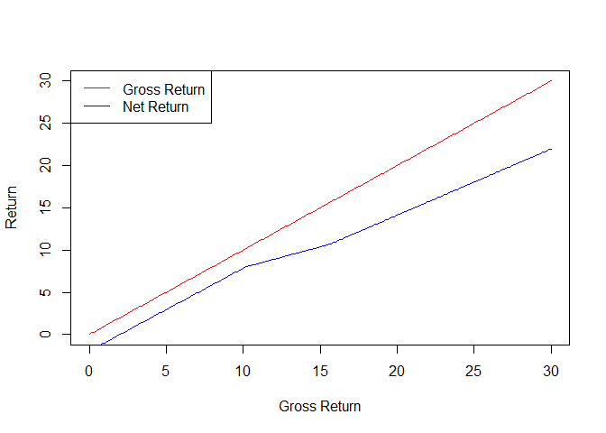
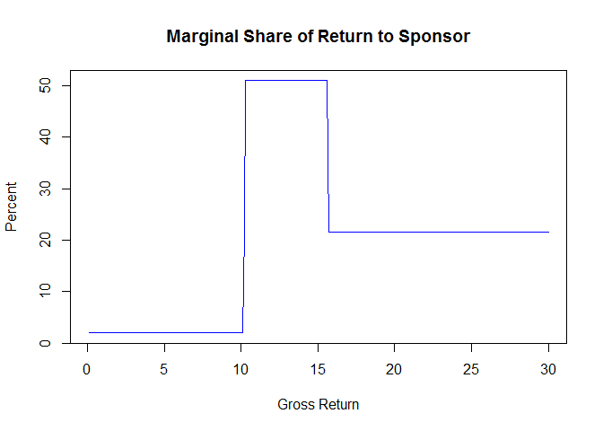
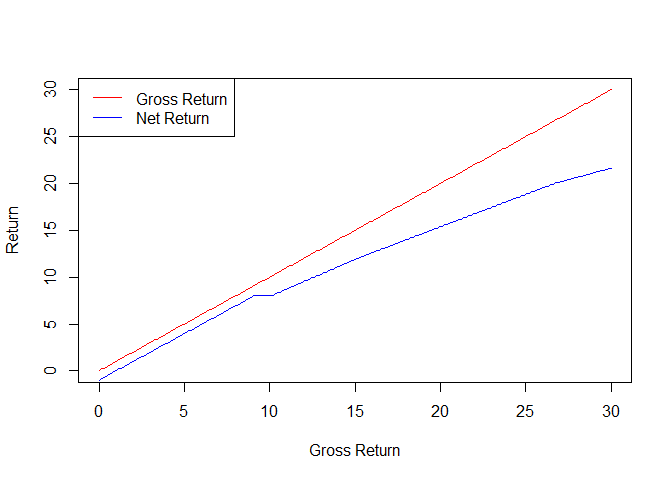
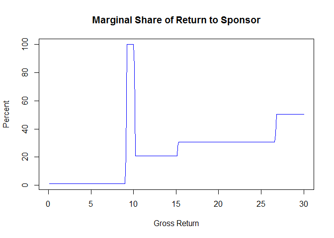
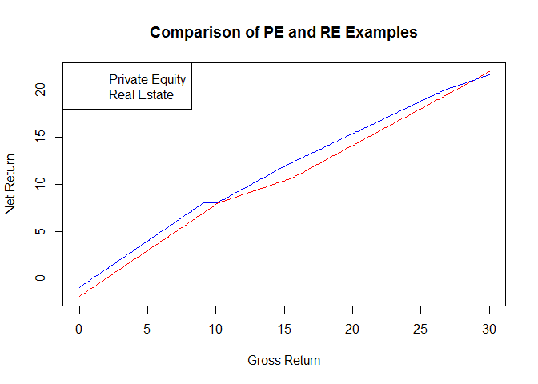

# General Partner Compensation in Real Estate and Private Equity Partneships 
Karl Polen  


### Abstract
This is a quick and dirty analyzer of general partner compensation in real estate and private equity partnerships.  It analyzes the outcomes across a range of performance scenarios in single period investment context.  It is useful for analyzing the sharing of income between the GP and investors as income varies.  Files for this post are found at https://github.com/karlpolen/waterfallqd

### Background
Real estate and private equity investments are typically owned in a partnership which includes a general partner (the "sponsor") and limited partners ("investors").  The sponsor organizes the investment, recruits the investors and manages the assets.  The general partner is typically compensated with an asset management fee and an incentive fee.

The asset management fee is usually stated as a percent per annum of assets under management.  This can be either as a percent of "commited" capital or "invested" capital.  In the former case, the fee is earned based on the amount the investors commit from the inception of the partnership without regard to when the capital is called.  If the asset management fee is based on invested capital, then the fee is calculated only on capital which has been called.  

The asset management fee is generally not contingent on performance, but on occasion investors can negotiate a deferral of a portion of an asset management fee until a minimum investment hurdle rate of return is achieved.  There is a great deal of variation in these arrangements and a person tasked with analyzing a partnership will need to refer to the partnership documents.

In this post we only consider the case of asset management fees on invested capital, but we allow a portion of the fee to be deferred based on performance.  In a later post, we will consider more complex structures in a multi-period project environment.

The incentive fee ("carry") is typically stated as a percent of profits. Profits are normally defined as the gross profits of the investments after returning partnership expenses including the asset management fee.  Usually, a hurdle rate of return must be achieved before sharing begins.  So, a typical deal might be stated as "20% carry over an 8% pref with a 50% catchup".  This means that the partnership has to earn at least 8% return before the sponsor earns any carry.  Above an 8% return, the sponsor gets half the profit (i.e. the catchup is 50%) until the ratio of profit split is 20% to sponsor.  Thereafter, the profits are split 80% to the investors and 20% to the sponsor.  Although the catchup is negotiable, usually from 50% to 100%, this is the nearly universal structure of private equity sponsor compensation.

Real estate deals have greater variation.  Many real estate deals have multiple layers, but no catchup. So, a real estate deal might be stated as "20 over 8, 30 over 12 and 50 over 20".  Stated this way, sponsor starts sharing 20% of profits once the investor earned an 8% return, switching to 30% of profits once the investor has earned a 12% return and 50% of profits once the investor has earned a 20% return.  There is no catchup in this structure, but between the 8% and 12% hurdle sponsor carry starts to drag on return and the gross return needs to be higher than 12% before the the next level of carry  kicks in.

### Private Equity Example

Let's revisit the typical private equity structure ("20 over 8 with a 50% catchup").  We will add a 2% asset management fee and consider the sharing of cash in the context of an investment with a hold period of exactly one year.  

#### Level 0 -- the investment

Invest $100 in an asset.  In addition, the investor has to pay the asset management fee of $2.  So, they have invested $102

We now illustrate the distribution of cash with a sale of the investment

#### level 1 -- return of capital

The first $102 goes to pay back the investor's capital -- $102 cumulative cash, 2% gross return, 0% net return

#### level 2  -- pay pref

The next 8.16 dollars goes to cover the "pref" of 8%.  $110.16 cumulative cash. 10.2% gross return, 8% net return

#### level 3 -- catchup

We now start splitting 50/50 until the sponsor has 20% of the distributed profit

Here we have a simple algebra problem

We are looking for a value of $x$ where

$\frac{.5x}{8.16+x}=.2$

Let's solve for x

$x=3.264+.4x$

$.6x=3.264$

$x=\frac{3.264}{.6} = 5.44$ 


So, the next 5.44 dollars are distributed 50/50.

At this point, $115.6 has been distributed, of which $2.72 went to the sponsor as incentive fee.  The gross return is 15.6% and the investor has received a net return of 12.9%.

#### level 4 -- parri passu

Remaining cash is distributed 80/20.  Suppose the asset is sold for $130.


The limited partner receives $102 return of capital plus $22.4.  The sponsor receives $5.6 incentive fee in addition to the $2 it received as an asset management fee.

The gross return on the investment is 30%.  The net return to the investor is 22%.

### Real Estate Example

Now let's consider the real estate example -- "20 over 8, 30 over 12 and 50 over 20".  In this case we will consider an asset management fee of 2%, half of which is deferred until at least an 8% return is earned.  Again, we will assume the hold period is exactly one year.

#### Level 0 -- the investment


We invest $100 in an asset and pay the non-deferred portion of the asset management fee of $1.  The investor has invested $101.

#### Level 1 -- return of capital

The first $101 goes to return of capital.  $101 cumulative distributed, 1% gross return and 0% net return

#### Level 2 -- pay pref

The next $8.08 goes to pay pref.  $109.08 cumulative distributed, 9.1% gross return, 8% net return

#### Level 3a -- pay the deferred asset management fee

The next $1 goes to pay the deferred asset management fee.  $110.08 cumulative distributed, 10.1% gross return and 8% net return.

#### Level 3b -- 80/20 splits

At this level profits are split 80/20 until the investor has received a 12% return.  The required incremental amount to distribute to the investor is $4.04.  (Note: in a multiperiod example the spread between multi-tier pref layers expands over time with compounding.)

So, we are looking for $x1$ where

$.8x1=4.04$

$x1=1.25 \cdot 4.04 = 5.05$

So, we distribute the next $5.05 in 80/20 ratio.  $115.13 is the cumulative amount distributed of which the sponsor has received $1.01 in incentive fee, 15.1% gross return, 12% net return.

#### Level 4 -- 70/30 splits

At this level profits are split 70/30 until the investor has received 20% return.  The required incremental amount to distribute to the investor in this layer is $8.08.  So, we are looking for 

$.7 \cdot x2 = 8.08$

$x2 = 11.54$

So, the next $11.54 is distributed is split 70/30.  $126.67 is the cumulative amount distributed of which $4.47 is distributed to the sponsor as incentive fee, 26.7% gross return, and 20% net return.

#### Level 5 -- 50/50 splits

Remaining profits are split 50/50.  Suppose we sell the asset for $130.  The remaining amount to distribute after prior levels is $3.33 which is split 50/50.  The final outcome is that the sponsor has received $6.13 in incentive fee plus $2 in asset management fee.  The investor has received $122.86.  The gross return is 30% and the net return to the investor is 21.64%.

### Code to perform these calculations

Now, let's demonstrate code to automate and generalize these calculations.

We create a function **`waterfall`** with four arguments.

The first argument is  __`dmat`__  for deal matrix.  

This is a data frame with one row for each level in the deal structure.  There are four columns in __`dmat`__ .
* **`am`** for the asset management fee at that level
* **`pref`** is the preferred return
* **`carry`** is the carry
* **`catchup`** is the catchup

The second argument **`ret`** is a vector of amounts to distribute upon which to analyze the structure.

The third argument **`invcost`** allows you to state an investment cost which can be different from capital called to the partnership because of asset management fees and other costs.

The fourth argument **`capital`** is the amount of capital called to the partnership for investments, asset management fees and other costs.

The function returns a list of four elements.

* __`lpshare`__ is a matrix of amounts distributed to the LP in the layers of the structure
* __`gpshare`__ is a matrix of amounts distributed to the GP in the layers of the structure
* __`grossreturn`__ is amounts distribued divided by the investment cost
* __`netreturn`__ is the total amount distributed to the LP divided by capital contributed

Here is the code.


```r
waterfall=function(dmat,ret,capital=100,invcost=100) {
  am=dmat$am
  pref=dmat$pref
  catchup=dmat$catchup
  carry=dmat$carry
  if(any(1<c(catchup,carry))) stop("catchup and carry must be stated as decimals<1")
  pref=c(pref,100000)
  am=c(am,0)
  stack=vector()
  lpcut=vector()
  typ=vector()
  nlayer=nrow(dmat)
  if(am[1]>0) {
    stack=c(stack,am[1])
    lpcut=c(lpcut,0)
    typ=c(typ,paste("Asset mgmt",0))
  }
  if (capital>0) {
    stack=c(stack,capital)
    lpcut=c(lpcut,1)
    typ=c(typ,paste("Return of Capital"))
  }
  if(pref[1]>0) {
    stack=c(stack,pref[1])
    lpcut=c(lpcut,1)
    typ=c(typ,paste("Preferred Return",1))
  }
  for (j in 1:nlayer) {
    if(am[j+1]>0) {
      stack=c(stack,am[j+1])
      lpcut=c(lpcut,0)
      typ=c(typ,paste("Asset Mgmt",j))
    }
    nextpref=pref[j+1]
    lpsofar=sum(stack*lpcut)-capital
    lpshort=nextpref-lpsofar
    cu=catchup[j]
    cy=carry[j]
    catchuplayer=0
    if(cu>cy) {
      catchuplayer=(lpsofar*cy)/(cu-cy)
      if (cu<1) catchuplayer=min(catchuplayer,lpshort/(1-cu))
      stack=c(stack,catchuplayer)
      lpcut=c(lpcut,(1-cu))    
      typ=c(typ,paste("Catchup",j))
    }
    lpsofar=sum(stack*lpcut)-capital
    lpshort=nextpref-lpsofar
    carrylayer=lpshort/(1-cy)
    if(carrylayer>0) {
      stack=c(stack,carrylayer)
      lpcut=c(lpcut,(1-cy))
      typ=c(typ,paste("Carry",j))
    }
  }
  ansmat=matrix(0,nrow=length(stack),ncol=length(ret))
  for (i in 1:length(ret)) {
    ansmat[,i]=wf(stack,ret[i])[-(1+length(stack))]
  }
  ans=list()
  ans$lpshare=matrix(lpcut,nrow=length(stack),ncol=length(ret))*ansmat
  rownames(ans$lpshare)=typ
  ans$gpshare=ansmat-ans$lpshare
  rownames(ans$gpshare)=typ
  ans$grossreturn=100*(ret-invcost)/invcost
  ans$netreturn=100*(colSums(ans$lpshare)-capital)/capital
  ans$stack=stack
  ans$lpcut=lpcut
  return(ans)
}
#given waterfall w in dollars and available cash c, distribute the cash to the waterfall
wf=function(w,c){
  x=c-cumsum(w)
  x[x>0]=0
  x=x+w
  x[x<0]=0
  c(x,c-sum(x))
}
testans=function(ans) {
  (colSums(ans$lpshare))+(colSums(ans$gpshare))
}
```

### Examples of use of function

#### Replication of the private equity example


```r
peinv=100
pecap=102
dmat.pe=data.frame(am=0,pref=(.08*pecap),catchup=.5,carry=.2)
ans.pe=waterfall(dmat.pe,ret=seq(100,130,.1),invcost=peinv,capital=pecap)
```

Here is a plot that shows the share going to sponsor and investor.


```r
plot(ans.pe$grossreturn,ans.pe$grossreturn,type='l',col='red',xlab='Gross Return',ylab='Return')
lines(ans.pe$grossreturn,ans.pe$netreturn,type='l',col='blue')
legend('topleft',legend=c('Gross Return','Net Return'),col=c('red','blue'),lwd=1)
```

<!-- -->

This plot shows the share of profit going to the GP on the margin.


```r
deltaprofit=diff(ans.pe$grossreturn)
deltagp=diff(ans.pe$grossreturn-ans.pe$netreturn)
gpcut=100*deltagp/deltaprofit
plot(ans.pe$grossreturn[-1],gpcut,
     main=('Marginal Share of Return to Sponsor'),
     xlab='Gross Return',
     ylab='Percent',type='l',col='blue')
```

<!-- -->

As you can see, the share to the GP increases to 50% during the catchup phase.  It then drops to 20% for returns above the breakeven where the GP has 20% of the cumulative profits.

#### Replication of Real Estate example

Let's do the same for the real estate example.


```r
reinv=100
recap=101
dmat.re=data.frame(am=c(0,1,0),pref=c(.08,.12,.20)*recap,catchup=c(0,0,0),carry=c(.2,.3,.5))
ans.re=waterfall(dmat.re,ret=seq(100,130,.1),invcost=reinv,capital=recap)
```

Here is a plot that shows the share going to sponsor and investor.


```r
plot(ans.re$grossreturn,ans.re$grossreturn,type='l',col='red',xlab='Gross Return',ylab='Return')
lines(ans.re$grossreturn,ans.re$netreturn,type='l',col='blue')
legend('topleft',legend=c('Gross Return','Net Return'),col=c('red','blue'),lwd=1)
```

<!-- -->

This plot shows the share of profit going to the GP on the margin.


```r
deltaprofit=diff(ans.re$grossreturn)
deltagp=diff(ans.re$grossreturn-ans.re$netreturn)
gpcut=100*deltagp/deltaprofit
plot(ans.re$grossreturn[-1],gpcut,
     main=('Marginal Share of Return to Sponsor'),
     xlab='Gross Return',
     ylab='Percent',type='l',col='blue')
```

<!-- -->

As you can see, the GP share spikes when they recover their share of the deferred management fee, then follows the stairstep of 20%, 30% and 50% shares of profit above the hurdle rates delivered to the investor.

Finally, let's compare the net returns of the private equity and real estate examples.


```r
peg=ans.pe$grossreturn
reg=ans.re$grossreturn
## which gross returns are in both answers?
peind=which(peg %in% reg)
reind=which(reg %in% peg)
plot(peg[peind],ans.pe$netreturn[peind],type='l',col='red',ylab='Net Return',
     xlab='Gross Return',main='Comparison of PE and RE Examples')
lines(peg[peind],ans.re$netreturn[reind],type='l',col='blue')
legend('topleft',legend=c('Private Equity','Real Estate'),col=c('red','blue'),lwd=1)
```

<!-- -->

